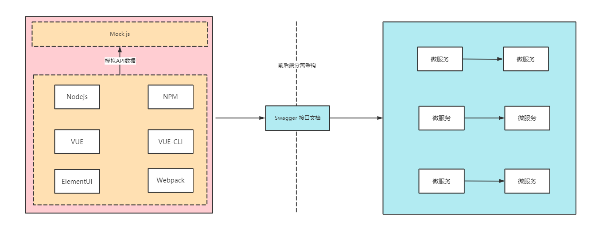
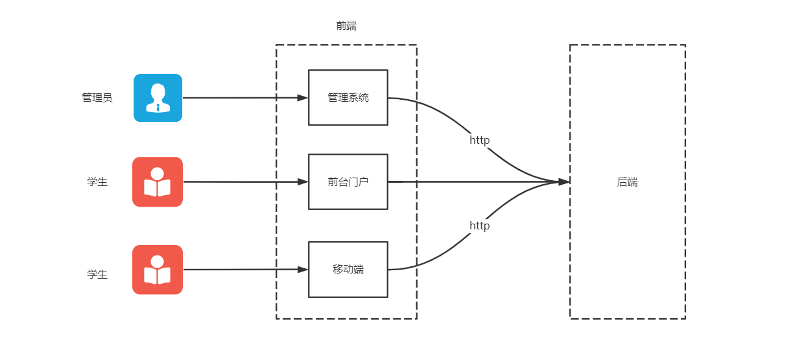
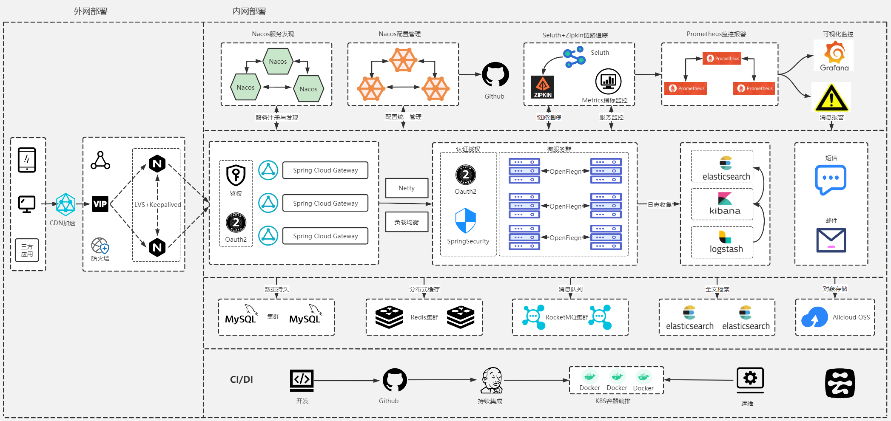

# 项目基本介绍

### 1.项目简介

云课堂，打造一款`在线IT学习`云平台,让用户节约时间、金钱成本，摆脱地域和时间的限制，自由享受IT课程学习的服务。用户能在云平台学习免费课程，也可以根据自己需求选择专业课程，`付费学习`。用户也能通过论坛版块分享和查看自己及其它用户的提问与文章

### 2.功能架构图

平台主要业务如下

功能解释

- 管理系统 ： 组织机构管理，角色管理，权限管理，`数据字典`，系统设置，后台登录。

- 用户中心 ：VIP购买，个人中心，实名认证，资料完善。

- 认证中心 ：统一认证授权中心，前后台用户统一登录。

- 文件管理 ：分布式文件管理中心，基于`OSS对象存储`。

- 课程中心 ：讲师管理，课程管理，文件上传，课程发布，课程下架。

- 媒体数据 ：`视频分片上传`，`云服务器推流`，`视频云点播`。

- 消息系统 ：短信消息，邮件发送，站内信，系统消息，广告消息。

- 订单中心 ：VIP购买下单，`课程购买下单`，账户充值下单。

- 支付系统 ：`支付宝支付`，微信支付

- 课程秒杀 ：秒杀课程发布，课程秒杀

### 3.应用划分

项目分为 ： 管理端 ，门户端 ，移动端

- 管理端 : 管理端是后台管理系统，后台管理员，平台工作人员(客服，财务)使用 ， 管理员做平台基础管理工作，平台工作人员做相关业务，比如：数据审核，财务统计。

- 门户端：普通用户通过门户网站进行课程购买和学习，包括登录注册，课程搜索，课程购买，课程学习，社交等等。

- 移动端：提供：IOS,Andorid,小程序等让学生可以更加方便的学习

### 4.应用架构

项目采用主流的`前后端分离`模式，前端分为：系统管理前端，门户前端

### 5.技术栈

- `系统管理前端`采用技术栈为

  Node.js，Vue.js，Npm，WebPack，Vue Cli ，Element UI ，Easy Mock等等。

- `门户网站`前端技术栈为

  Html ,css,js ,jquery等等。

- `后端采用`微服务架构技术栈为

  微服务架构：
  - 按照功能拆分多个服务，每个服务可以独立技术选型,独立开发,独立部署,独立运维。
  - 单个服务使用基于ssm的springboot，服务间通过spring cloud协调.技术包括：
      - SpringCloud/Alibaba(Nacos,Gateway,OpenFeign,Sentinel) + MyBatisPlus + SpringBoot + SpringMVC  + Velocity (生成代码，模版引擎)
      - 数据存储：Mysql + Redis + Ali-Cloud-OSS + ElasticSearch +RocketMQ
      - 运维方面：阿里云服务器，Docker,Jenkins,K8S等等
      - 日志收集：Logstash + ElasticSearch + Kibana (ELK)
      - 监控报警：Metrics + Prometheus + Grafana +Aalertmanager

### 6.项目架构

项目架构图

架构说明

- 负载层 ： Nginx+lvs 
- 网关 ： Spring Cloud Gateway
- 服务通信 ： OpenFeign
- 服务熔断&降级&限流 ：Sentinel
- 服务发现&配置管理：Nacos
- 链路追踪 ： Zipkin+Seluth
- 认证授权：Security+Oauth2+JWT
- 日志收集: ELK
- 分布式缓存：Redis
- 消息队列：RocketMQ
- 全文搜索：ElasticSearch
- CI/DI ：Jenkins+Docker+K8S