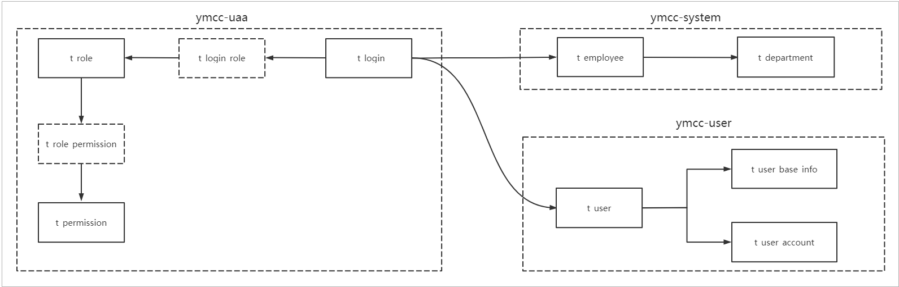
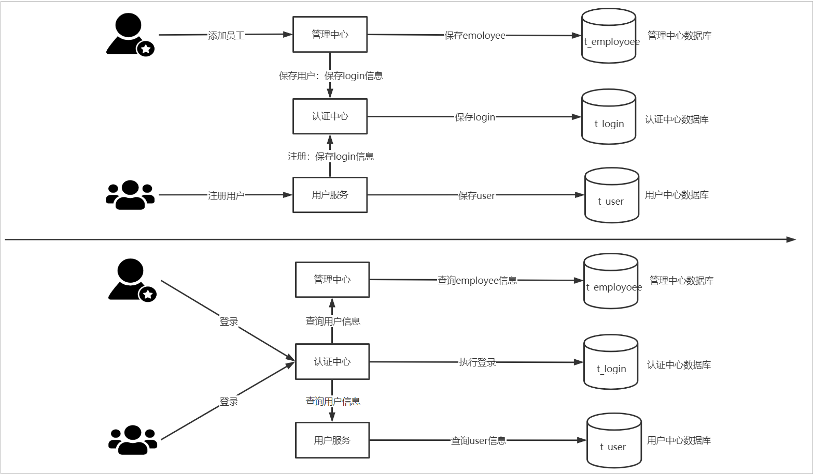
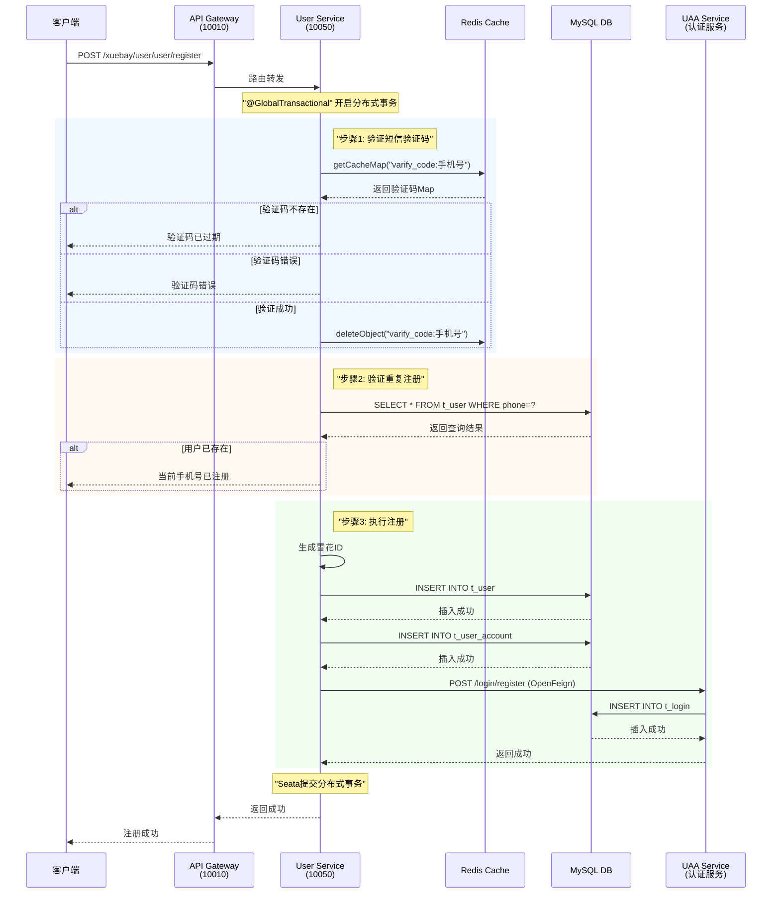
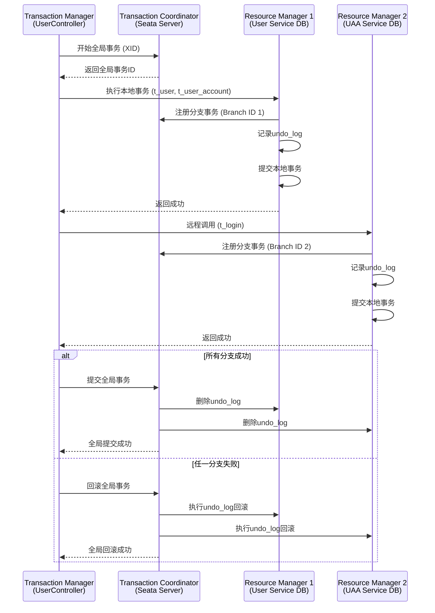

# 用户注册

## 数据库设计

```text
├── xuebay-uaa      			      //认证中心数据库 
│       └── t_login           ：公共的登录表，主要保存登录信息
│       └── t_login_role      ：用户和角色关系表
│       └── t_role            ：角色表
│       └── t_role_permission ：角色权限关系表
│       └── t_permission      ：权限表
│       └── t_menu            ：菜单表
├── xuebay-system         		  //管理系统数据库
│       └── t_employee        ：后台用户表 ，和t_login 关联一对一， 保存后台用户特有的字段
│       └── t_department      ：部门表
├── xuebay-user           			//用户数据库
│       └── t_user        	  ：前台用户表 ，和t_login 关联一对一 ，保存前台用户特有的字段
│       └── t_user_base_info  ：前台用户基本信息表,和t_user 关联一对一 
│       └── t_user_account 		：前台用户账户表,和t_user 关联一对一 
```

数据库关系如下



## 登录注册流程图



## 接口信息

**接口地址**: `POST http://127.0.0.1:10010/xuebay/user/user/register`

**服务路径**: Gateway (10010) → User Service (10050)

**涉及服务**:
- xuebay-gateway-service (API网关)
- xuebay-user-service (用户服务)
- xuebay-uaa-service (认证授权服务)
- Redis (缓存服务)
- MySQL (数据库)

---

## 请求参数结构

```java
RegisterDTO {
    String mobile;        // 手机号 (必填, 用于用户名)
    String password;      // 密码 (必填, 6-20位字母数字)
    String smsCode;       // 短信验证码 (必填)
    String imageCode;     // 图形验证码 (可选)
    Integer regChannel;   // 注册渠道 (可选)
}


```

**参数校验规则**:
- mobile: 不能为空
- password: 不能为空，正则 `^[a-zA-Z0-9]{6,20}$`
- smsCode: 不能为空

---

## 核心业务流程

### Controller层 (UserController)

```java
@GlobalTransactional  // Seata分布式事务注解
@PostMapping("register")
public JSONResult register(@RequestBody @Valid RegisterDTO registerDTO) {
    // 1. 验证短信验证码
    userService.validateVerifyCode(registerDTO.getMobile(), registerDTO.getSmsCode());
    
    // 2. 验证用户是否重复注册
    userService.validateExistsByPhone(registerDTO.getMobile());
    
    // 3. 执行注册逻辑
    userService.register(registerDTO);
    
    return JSONResult.success();
}
```

**关键点**:
- 使用 `@GlobalTransactional` 保证分布式事务一致性
- 使用 `@Valid` 进行参数校验
- 三步验证：验证码 → 重复注册 → 执行注册

### Service层 (UserServiceImpl)

#### 步骤1: 验证短信验证码
```java
public void validateVerifyCode(String phone, String smsCode) {
    // 从Redis获取验证码
    Map<String, Object> cacheMap = redisService.getCacheMap("varify_code:" + phone);
    
    // 判断验证码是否存在
    AssertUtil.isNotEmpty(cacheMap, "验证码已过期，请重新发送");
    
    // 比较验证码是否一致
    AssertUtil.isEquals(smsCode, (String) cacheMap.get("code"), "验证码错误");
    
    // 验证成功后删除缓存
    redisService.deleteObject("varify_code:" + phone);
}
```


#### 步骤2: 验证用户是否重复注册
```java
public void validateExistsByPhone(String phone) {
    User existUser = getOne(new QueryWrapper<User>()
        .lambda()
        .eq(User::getPhone, phone));
    
    AssertUtil.isNull(existUser, "当前手机号已注册，请勿重复注册");
}
```

#### 步骤3: 执行注册 (三表插入)
```java
public void register(RegisterDTO registerDTO) {
    // 生成雪花算法ID
    String userId = IdUtil.getSnowflakeNextIdStr();
    
    // 1. 初始化用户基本信息 (t_user表)
    initUser(registerDTO, userId);
    
    // 2. 初始化用户账户信息 (t_user_account表)
    initUserAccount(registerDTO, userId);
    
    // 3. 初始化登录认证信息 (t_login表 - UAA服务)
    initUaaLogin(registerDTO, userId);
}
```

##### 初始化用户信息 (t_user)
```java
private void initUser(RegisterDTO registerDTO, String userId) {
    User user = new User();
    user.setId(userId);                    // 雪花ID
    user.setPhone(registerDTO.getMobile());
    user.setNickName(registerDTO.getMobile()); // 默认昵称=手机号
    user.setBitState(DataStatus.ENABLE.getCode()); // 状态: 0-启用
    user.setCreateTime(new Date());
    user.setUpdateTime(new Date());
    this.save(user);
}
```


##### 初始化用户账户 (t_user_account)
```java
private void initUserAccount(RegisterDTO registerDTO, String userId) {
    UserAccount account = new UserAccount();
    account.setId(userId);                 // 与用户ID一致
    account.setFrozenAmount(BigDecimal.ZERO);  // 冻结金额: 0
    account.setUsableAmount(BigDecimal.ZERO);  // 可用金额: 0
    account.setPassword("");               // 密码字段为空
    account.setCreateTime(new Date());
    account.setUpdateTime(new Date());
    userAccountService.save(account);
}
```

##### 初始化登录信息 (t_login - 远程调用UAA服务)
```java
private void initUaaLogin(RegisterDTO registerDTO, String userId) {
    Login login = new Login();
    login.setId(userId);                   // 与用户ID一致
    login.setUsername(registerDTO.getMobile());
    login.setPassword(registerDTO.getPassword()); // TODO: 需要加密
    login.setType(UserTypeStatus.FRONT_USER.getCode()); // 类型: 0-前台用户
    login.setEnabled(1);                   // 启用
    login.setAccountNonExpired(1);         // 账户未过期
    login.setCredentialsNonExpired(1);     // 凭证未过期
    login.setAccountNonLocked(1);          // 账户未锁定
    
    // 通过OpenFeign调用UAA服务
    loginServiceApi.register(login);
}
```

### UAA服务 (LoginController)
```java
@PostMapping("login/register")
public JSONResult register(@RequestBody Login login) {
  	// 直接保存到t_login表
    loginService.save(login);  
    return JSONResult.success();
}
```


## 时序图



## Redis缓存结构

**验证码缓存**

**Key格式**: `varify_code:{手机号}`

**Value结构** (Hash):

```json
{
    "code": "123456",
    "timestamp": "1709697600000"
}
```

**过期时间**: 通常5-10分钟 (由common-service配置)

**生命周期**:
1. 用户请求发送验证码 → 写入Redis
2. 用户提交注册 → 验证并删除
3. 超时未使用 → 自动过期

---


##  分布式事务机制 (Seata)

### 事务模式
使用 **AT模式** (Automatic Transaction)

### 事务范围
```
UserController.register() [@GlobalTransactional]
├── UserService.validateVerifyCode()     [读Redis - 非事务]
├── UserService.validateExistsByPhone()  [读MySQL - 事务内]
└── UserService.register()               [写MySQL - 事务内]
    ├── initUser()                       [本地事务 - t_user]
    ├── initUserAccount()                [本地事务 - t_user_account]
    └── initUaaLogin()                   [远程事务 - t_login via Feign]
```

### 事务协调流程



### 补偿机制

#### 自动补偿 (Seata AT模式)
- **一阶段**: 执行业务SQL，记录前后镜像到undo_log
- **二阶段提交**: 异步删除undo_log
- **二阶段回滚**: 根据undo_log生成反向SQL执行回滚


#### 回滚场景示例

**场景1: UAA服务调用失败**
```
1. t_user 已插入 → 生成undo_log_1
2. t_user_account 已插入 → 生成undo_log_2
3. t_login 插入失败 → 触发全局回滚
4. Seata执行:
   - DELETE FROM t_user_account WHERE id=?
   - DELETE FROM t_user WHERE id=?
```

**场景2: 网络超时**
```
1. 本地事务已提交
2. 远程调用超时 (不确定是否成功)
3. Seata TC协调:
   - 查询分支事务状态
   - 根据状态决定提交或回滚
```

---

## 异常处理机制

### 业务异常
| 异常场景 | 异常信息 | HTTP状态码 | 处理方式 |
|---------|---------|-----------|---------|
| 参数格式错误 | "密码格式不正确" | 400 | 参数校验拦截 |
| 验证码过期 | "验证码已过期，请重新发送" | 400 | AssertUtil抛出 |
| 验证码错误 | "验证码错误" | 400 | AssertUtil抛出 |
| 手机号已注册 | "当前手机号已注册，请勿重复注册" | 400 | AssertUtil抛出 |
| 数据库异常 | "系统异常" | 500 | 全局异常处理 |
| 远程调用失败 | "服务调用失败" | 500 | Feign异常处理 |

### 异常处理流程
```java
try {
    // 业务逻辑
} catch (BusinessException e) {
    // 业务异常 - 直接返回错误信息
    return JSONResult.error(e.getMessage());
} catch (Exception e) {
    // 系统异常 - 记录日志 + 回滚事务
    log.error("注册失败", e);
    throw new RuntimeException("系统异常，请稍后重试");
}
```
